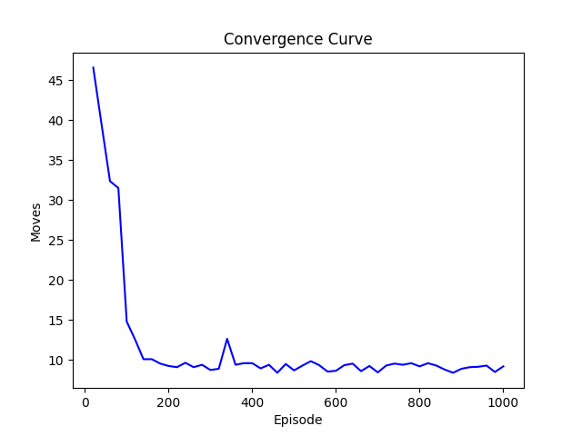

# Reinforcement Learning — Object Transportation Problem

The goal of this project is to develop a Python program that solves a **Markov Decision Problem (MDP)**.

-----

## 1) Components

In this project, you'll find the following components — each represented by a file:

- [description-and-requirements.pdf](./description-and-requirements.pdf): a PDF file containing the description of the problem the program aims to solve (in Portuguese, PT-BR);
- [execute.py](./execute.py): a Python script implementing the solution for the proposed problem;
- [scenario.map](./scenario.map): a file containing the layout of the problem's scenario in an ASCII representation. This file is read by the program to load the configuration of the tested scenario;
- [problem-config.csv](./problem-config.csv): a file containing the hyperparameters of the training process for the agent the walks through the scenario. This file is read by the program to load these same hyperparameters.

-----

## 2) Solution

### 2.1) Running the program

Before executing, follow the steps below:

1. Make sure to have Python installed:
   - You can test it by running the command `python --version`;
2. Either clone this repository, or download it as ZIP file via GitHub and extract it to the directory of your choice:
   - Clone: `git clone git@github.com:RafaelSchubert/furb-datascience-reinforcementlearning-work-01.git`;
   - Download as [ZIP](https://github.com/RafaelSchubert/furb-datascience-reinforcementlearning-work-01/archive/refs/heads/main.zip);
3. Make sure you have the following Python packages installed:
   - Matplotlib: `pip install matplotlib`;
   - Pandas: `pip install pandas`;

To execute the solution in this project, run the following commands:

```sh
$ cd the-project-folder/
$ python -m execute
```

### 2.2) Program output

Each time the script is ran, it produces the outputs below:

- A line notifying the end of the execution, with the time (in seconds) spent running all the episodes:

```
Ran 1000 episode(s) in 0.85 second(s).
```

- An image with a plot describing the average number of moves executed before the end of an episode. The values are averaged for each 20 episodes.


